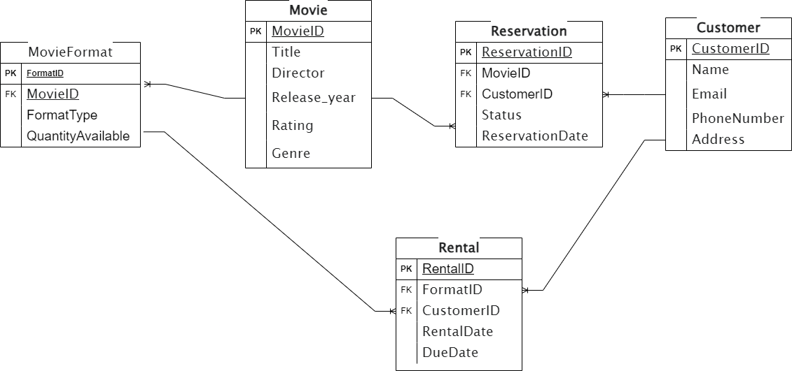

# RentalFlix

RentalFlix is a web-based API designed to manage a movie rental service. This system replaces the traditional manual tracking of movies, customers, and rentals with a digital solution. It helps efficiently manage movie inventory, customer information, and rental records, ensuring a seamless experience for both staff and customers.

## Database Schema
The database schema includes the following tables:
* Movie: Stores information about movies.
* MovieFormat: Details the formats and quantities of each movie.
* Customer: Holds customer information.
* Rental: Tracks rental records.
* Reservation: Manages reservation records.

## Explanation of Tables
### Movie

MovieID (PK): Unique identifier for each movie.
Title: Title of the movie.
Genre: Genre or category of the movie.
Director: Director of the movie.
ReleaseYear: The year the movie was released.
Rating: Movie rating (e.g., PG, PG-13, R).

### MovieFormat

FormatID (PK): Unique identifier for each movie format.
MovieID (FK): Identifier of the movie.
FormatType: Type of format (DVD, Blu-ray, Digital).
QuantityAvailable: Number of copies available for rent.

### Customer

CustomerID (PK): Unique identifier for each customer.
Name: Name of the customer.
Address: Address of the customer.
Phone: Contact phone number.
Email: Contact email address.

### Rental

RentalID (PK): Unique identifier for each rental record.
CustomerID (FK): ID of the customer who rented the movie.
FormatID (FK): ID of the movie format that was rented.
RentalDate: Date when the movie was rented.
DueDate: The date when the movie is due to be returned.
ReturnDate: Date when the movie was returned (nullable).

### Reservation

ReservationID (PK): Unique identifier for each reservation.
CustomerID (FK): ID of the customer who reserved the movie.
MovieID (FK): ID of the reserved movie.
ReservationDate: Date when the reservation was made.
Status: Status of the reservation (active, fulfilled, canceled).

## Drawing Entity Relationship Diagram **(RED)**

